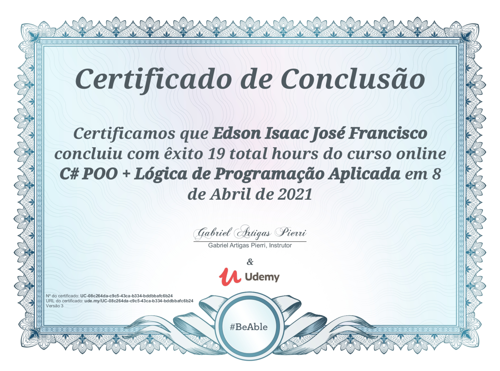
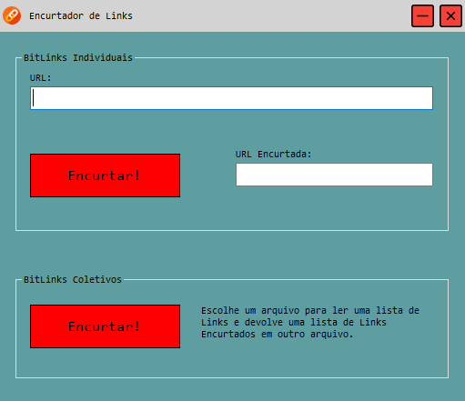
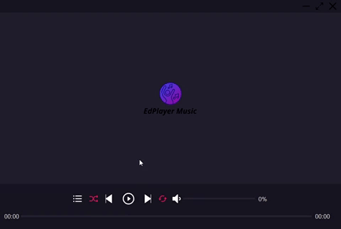
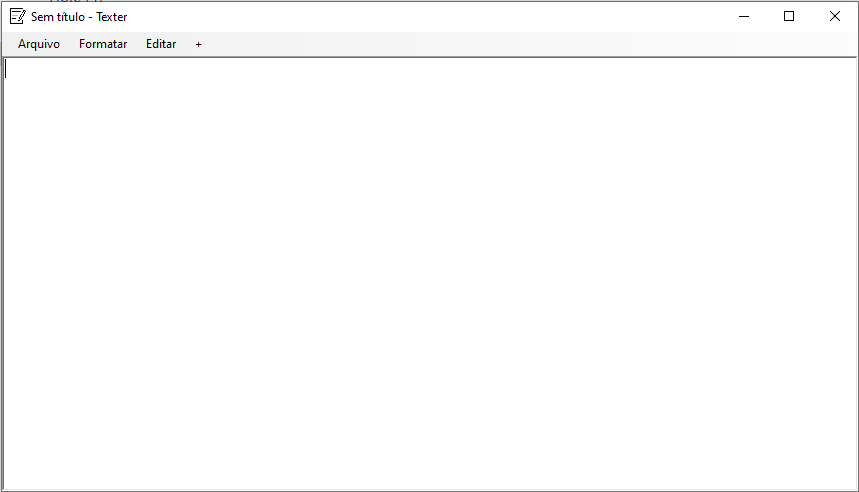
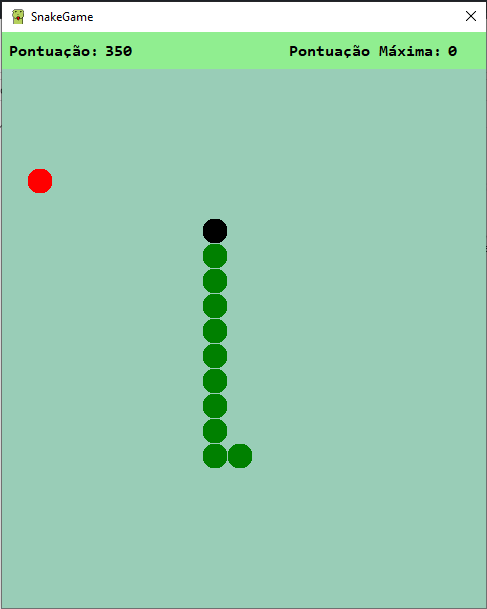
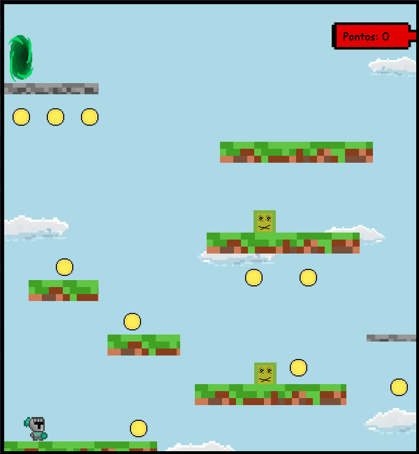

## Apresentação Geral

**Nome do Projeto:** Projetos C#

**Descrição:**

Este repositório contém os exercícios realizados durante o curso de C# na plataforma Udemy. 

Além disso, inclui projetos pessoais, variando desde os mais simples, utilizados para testar componentes 
do Windows Forms, até projetos mais complexos, como versões básicas de softwares do dia a dia e jogos.

- [Encurtador](https://github.com/Edssaac/projetos-csharp/tree/main/Projetos/Encurtador-de-Links)

  Encurtador de Links que utiliza a API do Bitly.

   

- [PlayerUI](https://github.com/Edssaac/projetos-csharp/tree/main/Projetos/PlayerUI)

  Interface de um software reprodutor de músicas.
 
  

- [Texter](https://github.com/Edssaac/projetos-csharp/tree/main/Projetos/Texter)

  Um software para criação e edição de arquivos de texto, baseado no bloco de notas do Windows.
 
  

- [Snake](https://github.com/Edssaac/projetos-csharp/tree/main/Projetos/SnakeGame)

  Clássico e conhecido jogo da cobrinha.
 
  

- [Sharpth](https://github.com/Edssaac/projetos-csharp/tree/main/Projetos/Sharpth)

  Um jogo de plataforma original, que reúne a experiência e os conhecimentos adquiridos em meus projetos anteriores.
 
  

**Tecnologias Utilizadas:**

## Contato

